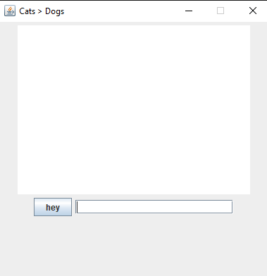

**1. Φτιάξτε ένα παράθυρο με ένα κουμπί. Το κείμενο πάνω στο κουμπί θα πρέπει να αναγράφει το πόσες φορές έχει πατηθεί**

---
---

**2. Φτίαξτε ένα παράθυρο με δύο widgets. Ένα JTextArea και ένα κουμπί. Όταν ο χρήστης πατάει το κουμπί θα πρέπει να εμφανίζεται
κάποιο κείμενο στο JTextArea**

---
---

**3. Φτιάξτε αυτό το παράθυρο**

---
---
**4. Αλλάξτε το πρόγραμμα ώστε να διαβάζει το κείμενο που υπάρχει στο JTextField και να το γράφει σε ένα αρχείο όταν πατάτε το κουμπί**

---
---
